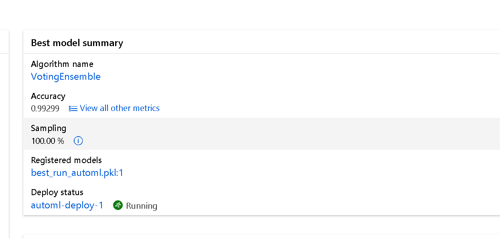

# Predicting Drug Related Stops from Traffic Stop data

This project builds a model to predict whether a traffic stop is drug related. I use AutoML and Hyper drive to build the best model and
then deploy that model as a web service endpoint.  I show  

## Dataset

### Overview

The [Stanford Open Policing Project ](https://www.kaggle.com/faressayah/stanford-open-policing-project) 

> On a typical day in the United States, police officers make more than 50,000 traffic stops. Our team is gathering, analyzing, and releasing records from millions of traffic stops by law enforcement agencies across the country. Our goal is to help researchers, journalists, and policymakers investigate and improve interactions between police and the public.

This dataset includes 9 Mb of stop data from Rhode Island, covering all of 2013 onwards. 

Here are the columns:
stop_date	stop_time	county_name	driver_gender	driver_age	driver_race	violation	search_conducted	search_type	stop_outcome	is_arrested	stop_duration	drugs_related_stop

This data has almost 10,000 rows of data, spanning around 10 years between 2005 and 2010.  The location is Rhode Island.  


### Task

Like in the class, the project trains a classifier to predict if the traffic stop will result in a drug related stop.


### Method to get data into Azure ML studio workspace

Please see the following python code:

```python
# create a TabularDataset from a dataset

dataset = Dataset.get_by_name(ws, name='police_project')
police_records = dataset.to_pandas_dataframe()

# preview the first 3 rows of the dataset
police_records.head(10)
```
For this code to work, I had to import the dataset into the Azure ML studio under "datasets.  From there, I could load it by name as shown in the code.  To look at the dataset, I used pandas to display the data in table form. As shown below, the variable "dataset" is given as the training_data in the auto_ml settings. 

## Automated ML

```python
automl_settings = {
    "task": 'classification',
    "iterations": 30,
    "experiment_timeout_minutes": 15,
    "primary_metric": 'accuracy',
    "training_data": dataset,
    "label_column_name": 'drugs_related_stop',
    "n_cross_validations": 3,
    "max_concurrent_iterations": 8,
    "max_cores_per_iteration": -1
}
```
I decied to use a limited in time and number of iterations as I am using my own platform and paying for it but I did make use of concurrent iterations and I also use themaximum number of cores available.. 
I used 3 fold cross validation to evaluate the model and since I am using classification for the taks, I optimized around accuracy because I wanted to the most accurate model to predict the outcome of a drugs_related_arrest. 

### Results

See the best model here:
The best model generated by AutoML is a VotingEnsemble method. A voting ensemble works by combining the predictions from multiple models. I use classification, and thus the predictions for each label are summed and the label with the majority vote is predicted.
* --------------------------------------------------
* --------------------------------------------------
* Here is a screenshot of the best model: 

* --------------------------------------------------
* --------------------------------------------------
* And here it shows the accuracy: 

* --------------------------------------------------
* --------------------------------------------------
* Here is the RunDetailsfor my AutoML experiment: 

* --------------------------------------------------
* --------------------------------------------------
* Here is the RunDetails Widget when I click Run Details:


* --------------------------------------------------
* --------------------------------------------------
## Hyperparameter Tuning

I decided to use the `RandomForestClassifier` in SKlearn because it was the most intuitive to me.  From the documentation:
"A random forest is a meta estimator that fits a number of decision tree classifiers on various sub-samples of the dataset."
I read about this on Kaggle blogs.  
I chose two parameters:
    * `n-estimators`: the number of estimators, in the range [50, 300]
    * `max-depth`: the maximum depth of each tree, in the range [1, 40] Note:  The platform recommended using 40 after my first run

These parameters give the greatest influence on overfitting/underfitting according to [this article](https://towardsdatascience.com/hyperparameters-of-decision-trees-explained-with-visualizations-1a6ef2f67edf). 

### Results

After the maximum number of iterations (30) the model was 99% accurate.  See below for details:
* --------------------------------------------------
* Here is the hyperdrive's experiment best model:


* --------------------------------------------------
* And here is it's accuracy: 
* 
* --------------------------------------------------
* --------------------------------------------------
* --------------------------------------------------
* Here are the run details for the hyperdrive run:
* 
* Here is the run widget for the hyperdrive run:
* 
* --------------------------------------------------
## Improvements

* As suggested in the project, I could convert the model to ONXX format and deploy the model on the edge.
* The data set is relatively small - about 10,000 rows.  Getting more data would improve the model. 
* I would like to explore feature engineering with this project but I ran out time. 
* There are ways to improve the model using the RandomForestCLassifer but working with the number of samples of a tree so I could experiment with that and see if the model improves. 
* For the hyperdrive experiment, I could use even more hyperparameters, use a different Parameter Sampler, use more datasets, and use cross-validation to reduce over-fitting or choose other robust models.
* For AutoML, do things to prevent over-fitting, using the best practices such as:
1. Using more training data, and eliminating statistical bias
2. Preventing target leakage
3. Using fewer features
4. Regularization and hyperparameter optimization
5. Model complexity limitations
6. Cross-validation

## Model Deployment

The model is deployed by these steps:

1. Register the model 
2. Download the model
2. Configure the environment
3. Define the configuration of the endpoint service
4. Deploy the model with the configuration and environment
5. Enable app insights 

Here is a screen shot of the deployed model:


Here is a screen shot of the environment details. I've also included all the files of the environment: see conda_env_v_1_0_0.yml and env_dependencies.json


In order to query and consume the endpoint we have to make a request with a JSON body where the `data` field is the dictionary representation of the data point
to predict
I sent the last row of data to the endpoint and it correctly predicted the outcome.  Here is example data.
```
{
               'stop_date': 1/23/2005,
               'stop_time': 23:15,
               'county_name': NA,
               'driver_gender': 1,
               'driver_age': 33,
			 'driver_race': White,
               'violation': Speeding,
               'search_conducted': FALSE,
               'search_type': NA,
               'stop_outcome':Citation,
               'stop_duration':0-15 Min,

}
```

The request is done over HTTP and made to the scoring_uri of the deployed model. 

## Standout Work
I did one of the standout suggestions - I was able to capture logging.  See below:


## Screen Recording

[My ScreenCast](https://youtu.be/A648F3SHp0M)
